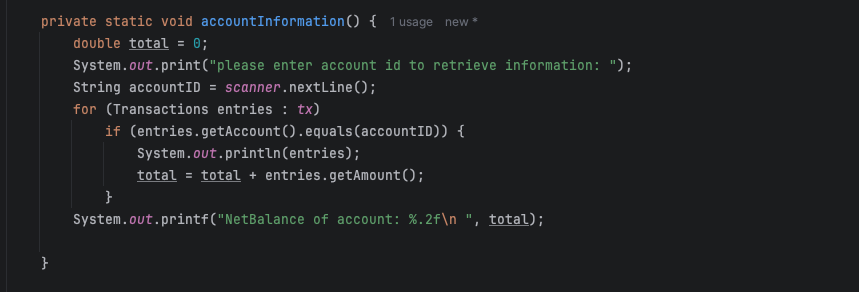
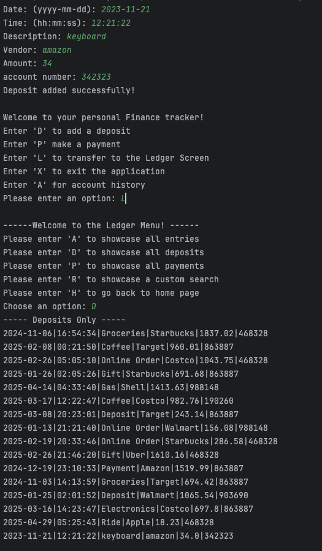
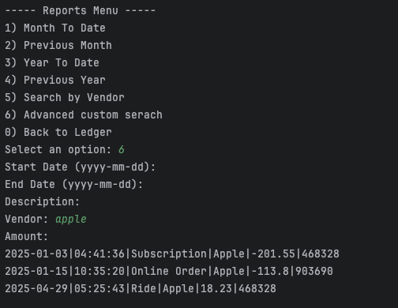

Capstone 1: Accounting Ledger Application

Created an application that allows a bank teller to
make deposits and payments to a certain account to store and retrieve that information,

You can also filter out for specific transactions through dates such as months or year.

prints out specific transactions according to their account number

Adding a deposit and then showcasing it has been added through the Ledger menu.

Here I filtered with vendor. Only printing transactions done by the apple vendor

